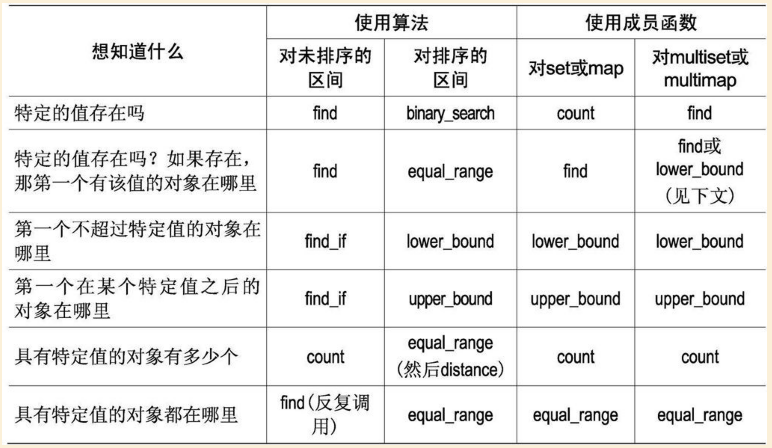

# 第一章 容器
### 2. 不要试图编写独立于容器类型的代码
+ 考虑到有时候不可避免的要从一种容器类型转换到另一种，你可以使用常规的方式来实现这种转变:使用封装技术。最简单的方式是通过对容器类型和其迭代器类型使用类型定义(`typedef`)
```cpp
class Widget {};
vector<Widget> vw;
Widget bestWidget;
vector<Widget>::iterator i = find(vw.begin(), vw.end(), bestWidget);
// 换成如下写法
class Widget {};
typedef vector<Widget> WidgetContainer;
typedef WidgetContainer::iterator WCIterator;
WidgetContainer cw;
Widget bestWidget;
WCIterator it = find(cw.begin(), cw.end(), bestWidget);
```

### 3: 确保容器中的对象副本正确而高效
+ 进去的是副本，出来的也是副本(copy in, copy out)，这是STL的工作方式
+ "剥离"问题意味着向基类对象的容器插入派生类对象几乎总是错误的
+ 是复制动作高效、正确，并防止剥离问题发生的一个简单办法是使容器包含指针而不是对象,但是指针的容器也有令人头疼的与STL相关的问题，这个时候**smart pointer**是一个很好的选择
```cpp
// instead of
Widget w[maxNumWidgets]; // 会立即创建出maxNumWidgets个Widget对象
// use
vector<Widget> w;
w.reserve(maxNumWidgets);
```

### 4: 调用empty而不是检查size()是否为0
+ `empty`对所有的标准容器都是常数时间操作,而对一些`list`实现,`size`耗费线性时间,`list`之所以这么讨厌，是因为`list`所独有的常数时间链接(`splice`)操作,由于`splice`操作是常数时间，`size`就要做出妥协，变为线性时间，如下:
```
list<int> list1;
list<int> list2;
list1.splice(
    list1.end(), list2,
    find(list2.begin(), list2.end(), 5),
    find(list2.rbegin(), list2,rend(), 10).base()
);
```

### 5: 区间成员函数优先于与之对应的单元素成员函数
+ 使v1的内容和v2的后半部分相同的最简单操作是:
```cpp
v1.assign(v2.begin() + v2.size() / 2, v2.end())
```
+ 几乎所有通过利用插入迭代器(`insert_iterator`)的方式(即利用`inserter`、`back_inserter`或`front_insert`)来限定目标的`copy`调用,其实都可以被替换为对区间成员函数`insert`的调用

```cpp
v1.clear();
copy(v2.begin() + v2.size() / 2, v2.end(), back_inserter(v1));
// 可以替换为
v1.insert(v1.end(), v2.begin() + v2.size() / 2, v2.end());
```

### 6: 当心C++编译器最烦人的分析机制
+ 假设有一个存有整数的文件，想把这些整数复制到一个list中，考虑以下代码:
```cpp
ifstream dataFile("ints.dat");
list<int> data(istream_iterator<int>(dataFile),
               istream_iterator<int>());
```
+ 编译器会认为以上代码只是声明了一个函数,因为C++编译器的一条普遍规律是，尽可能地解释为函数声明,有两种方法:
```cpp
list<int> data((istream_iterator<int>(dataFile)),
               istream_iterator<int>());
//更好的方法是在对data的声明中避免使用匿名的istream_iterator对象(尽管使用匿名对象是一种趋势，但此处为了工作正常，是需要付出点代价的)
ifstream dataFile("inits.data");
istream_iterator<int> dataBegin(dataFile);
istream_iterator<int> dataEnd;
list<int> data(dataBegin, dataEnd);
```

### 7: 如果容器中包含了通过new操作创建的指针,切记在容器对象析构前将指针delete掉
```cpp
void doSomething() {
    vector<Widget*> vwp;
    for (int i = 0; i < SOME_MAGIC_NUMBER; ++i)
        vwp.push_back(new Widget);
    // 这里发生了Widget泄露
}
```
+ 第一种解决方式
```cpp
template<typename T>
struct DeleteObject: public unary_function<const T*, void> {
    void operator()(const T* ptr) const {
        delete ptr;
    }
};
void doSomething() {
    // ...
    for_each(vwp.begin(), vwp.end(), DeleteObject<Widget>());
}
```

+ 进一步改善
```cpp
struct DeleteObject {
    template<typename T>
    void operator()(const T* ptr) const {
        delete ptr;
    }
};
void doSomething() {
    deque<SpecialString*> dssp;
    for_each(dssp.begin(), dssp.end(), DeleteObject());
}
```

+ 以上方式如果在for_each调用前发生异常，仍然发生资源泄露,进一步改善依赖智能指针
```cpp
void doSomething() {
    typedef boost::shared_ptr<Widget> SPW;
    vector<SPW> vwp;
    for (int i = 0; i < SOME_MAGIC_NUMBER; ++i)
        vwp.push_back(SPW(new Widget));
}
```

### 8. 切勿创建包含`auto_ptr`的容器
+ `auto_ptr`的容器是被禁止的，试图使用它们的代码不会被编译通过
+ 原因是当你复制一个`auto_ptr`时，它所指向的对象的所有权被移交到拷入的`auto_ptr`上，而它自身被置为`NULL`
```cpp
auto_ptr<Widget> pw1(new Widget);
auto_ptr<Widget> pw2(pw1); // pw2指向pw1的Widget,pw1被置为NULL
```

### 9. 慎重选择删除元素的方法(*网易游戏面试题*)
+ 要删除容器中有特定值的所有对象:
    + 容器是`vector,string,deque`,则使用`erase-remove`
    ```cpp
    vector<int> c;
    c.erase(remove(c.begin(), c.end(), 1963), c.end());
    ```
    + 容器是`list`,则使用`remove`
    ```cpp
    list<int> c;
    c.erase(1963);
    ```
    + 容器是关联容器(`set/multiset/map/multimap`),使用`erase`成员函数
    ```cpp
    set<int> c;
    c.erase(1963); 
    ```
+ 要删除容器中满足特定判别式（条件）的所有对象
    + 容器是`vector, string, deque`,则使用`erase-remove_if`
    ```cpp
    bool badValue(int x);
    c.erase(remove_if(c.begin(), c.end(), badValue), c.end());
    ```
    + 容器是`list`,用`remove_if`
    ```cpp
    c.remove_if(badValue); 
    ```
    + 容器是标准关联容器,使用`remove_copy_if和swap`,或者写一个循环来遍历容器中的元素，记住当把迭代器传给`erase`时，要对它*后缀递增*
    ```cpp
    // first way
    AssocContainer<int> c;
    AssocContainer<int> goodValues;
    remove_copy_if(c.begin(), c.end(),
                    inserter(goodValues,
                             goodValues.end()),
                             badValue);
    c.swap(goodValues);

    // second way
    AssocContainer<int> c;
    for (AssocContainer<int>::iterator i = c.begin();
        i != c.end();) {
        if (badValue(*i)) c.erase(i++);
        else ++i;
    }
    ```
+ 要在循环内部做某些（除了删除对象之外的）操作
    + 标准序列容器,则写一个循环来遍历容器中的元素，记住每次调用`erase`时，要用它的返回值更新迭代器
    ```cpp
    for (SeqContainer<int>::iterator i = c.begin();
        i != c.end();) {
        if (badValue(*i)) {
            logFile << "Erasing" << *i << "\n";
            i = c.erase(i);
        } else ++i;
    }
    ```
    + 标准关联容器，则写一个循环来遍历容器中的元素，记住当把迭代器传给`erase`时，要对迭代器做后缀递增
    ```cpp
    ofstream logFile;
    AssocContainer<int> c;
    for (AssocContainer<int>::iterator i = c.begin();
        i != c.end();) {
        if (badValue(*i)) {
            logFile << "Erase"  << *i << "\n";
            c.erase(i++);
        }
        else ++i;
    }
    ```

### 11. 理解自定义分配子的合理用法
+ 共享内存示例
```cpp
void* mallocShared(size_t bytesNeeded);
void* freeShared(void* ptr);

template<typename T>
class SharedMemoryAllocator {
public:
    pointer allocate(size_type numObjects, const void *localityHint = 0) {
        return static_cast<pointer>(mallocShared(numObjects * sizeof(T)));
    }

    void deallocate(pointer ptrToMemory, size_type numObjects) {
        freeShared(ptrToMemory);
    }

};

typedef vector<double, SharedMemoryAllocator<double> > SharedDoubleVec;

SharedDoubleVec v; //创建一个vector,其元素位于共享内存中
```

### 12. 切勿对STL容器的线程安全性有不切实际的依赖
+ STL只保证：多个线程读是安全的；多个线程对不同的容器做写入操作是安全的.
+ 如果要对一下代码考虑线程安全，则要自己利用锁机制
```cpp
vector<int> v;
vector<int>::iterator first5(find(v.begin(), v.end(), 5));
if (first5 != v.end()) {
    *first5 = 0;
}
```
+ 把以上代码变成线程安全
```cpp
template<typename Container>
class Lcok {
public:
    Lock(const Container& container): c(container) {
        getMutexFor(c);
    }
    ~Lock() {
        releaseMutexFor(c);
    }
private:
    const Container& c;
};

vector<int> v;
{
    Lock<vector<int> > lock(v);
    vector<int>::iterator first5(find(v.begin(), v.end(), 5));
    if (first5 != v.end()) {
        *first5 = 0;
    }
}
```
# 第二章 `vector`和`string`
### 13: `vector`和`string`优先于动态分配的数组

### 14: 使用`reserve`来避免不必要的重新分配
+ 为了避免重新分配过程中的额外开销(包括原内存的分配和释放,对象的复制和析构，迭代器、指针和引用的失效),如下代码
```cpp
vector<int> v;
for (int i = 1; i <= 1000; ++i) 
    v.push_back(i);
// 替换为
vector<int> v;
v.reserve(1000);
for (int i = 1; i <= 1000; ++i)
    v.push_back(i);
```

### 15：注意`string`实现的多样性

### 16: 了解如何把`vector`和`string`数据传给旧的API
```cpp
void doSomething(const int* pInts, size_t numInts);
// 可以如下,用&v[0],不要用v.begin()
if (!v.empty()) {
    doSomething(&v[0], v.size());
}

void doSomething(const char* pString);
// 可以如下
doSomething(s.c_str());
```
+ 用来自C API中的元素初始化`vector`
```cpp
size_t fillArray(double* pArray, size_t arraySize);
vector<double> vd(maxNumDoubles);
vd.resize(fillArray(&vd[0], vd.size()));
```

+ 先让C API把数据写入`vector`中，然后将数据复制到期望最终写入的STL容器中
```cpp
size_t fillArray(double* pArray, size_t arraySize);
vector<double> vd(maxNumDoubles);
vd.resize(fiilArray(&vd[0], vd.size()));
deque<int> d(vd.begin(), vd.end());
list<double> l(vd.begin(), vd.end());
```
+ 反过来，其他STL也可以先转成`vector`,在调用C API

### 17: 使用"swap技巧"除去多余的容量
+ 使容量从以前的最大值缩减到当前需要的数量,shrink-to-fit
```cpp
class Contestant {};
vector<Contestant> contestants;
// 下面实现shrink-to-fit
vector<Contestant>(contestants).swap(contestants);
``` 
+ `swap`另一种变化形式可以用来清除一个容器，并使容量变为该实现下的最小值
```cpp
vector<Contestant> v;
string s;
string().swap(s);  // 清除s并把它的容量变得最小
vector<Contestants>().swap(v);
```

### 18: 避免使用`vector<bool>`
+ `vector<bool>`不是一个STL容器;其次,它并不存储`bool`
```cpp
vector<bool> v;
bool *pb = &v[0]; //编译不通过的
// 因为C++中实现的vector<bool>使用了位域，即每个bool仅占一个二进制位
template<typename Allocator>
vector<bool, Allocator> {
public:
    class reference { };
    reference operator[](size_type n); //返回代理对象
}
```

+ 所以不要使用`vector<bool>`,尽量使用`deque<bool>和bitset`来代替

# 第三章 关联容器
### 19: 理解相等(equality)和等价的(equivalence)的区别
+ `find`算法对相同的定义是相等，是以`operator==`为基础的
+ `set`的`insert`对相同的定义是等价，是以`operator<`为基础的
+ 等价关系是以“在已排序的区间中对象值的相对顺序”为基础的,w1与w2等价的条件如下:
```cpp
!(w1 < w2) && !(w2 < w1)
```
+ 一般情形下,一个关联容器的比较函数并不是`operator<`,甚至也不是`less`,而是用户定义的判别式(predicate).两个对象x和y有等价的值：
```cpp
!c.key_comp()(x, y) && !c.key_comp()(y, x)
```

### 20: 为包含指针的关联容器指定比较类型
+ 假设有一个包含`string*`的`set`,把动物的名字插入到该集合,如果希望遍历时按照字典顺序输出，有以下做法:
```cpp
struct StringPrtLess:
    public binary_function<const string*,
                           const string*,
                           bool> {
    bool operator()(const string *ps1, const string *ps2) const {
        return *ps1 < *ps2;
    }
};
typedef set<string*, StringPtrLess> StringPtrSet;
StringPtrSet ssp; // 即可实现要求
ssp.insert(new string("Apple"));
ssp.insert(new string("Cat"));
ssp.insert(new string("Boy"));
ssp.insert(new string("Dog"));
transform(ssp.begin(), ssp.end(), ostream_iterator<string>(cout, "\n"), Dereference());

// 另一种方法
struct DerefenceLess {
    template<typename PtrType> bool operator()(PtrType pT1, PtrType pT2) const {
        return *pT1 < *pT2;
    }
};
set<string*, DerefenceLess> sp;
sp.insert(new string("ice"));
sp.insert(new string("google"));
sp.insert(new string("hello"));
transform(sp.begin(), sp.end(), ostream_iterator<string>(cout, "\n"), Dereference());
```

### 21: 总是让比较函数在等值情况下返回`false`
+ 考虑一下反例:
```cpp
set<int, less_equal<int> > s;
s.insert(10);
s.insert(10); //从道理上讲，这一次的insert应该失败，但是由于违反了准则，这一次仍然能够插入，因为!(10A <= 10B) && !(10B <= 10A)
``` 
+ 比较函数的返回值表明的是按照该函数定义的排列顺序，一个值是否在另一个之前。相等的值从来不会有前后顺序关系，所以，对于相等的值，比较函数应当返回false.

### 22: 切勿直接修改`set`或`multiset`中的键
+ `map`和`multimap`的键是`const`,而`set`和`multiset`不是,但是仍然记住不要改变键部分--元素的这部分会影响容器的排序性。如果改变了这部分内容，那么你可能会破坏该容器，再使用该容器将导致不确定的结果
+ 如果STL平台中`set`的键及非键成分均不允许修改,正确方式如下:先删除，再添加
```cpp
EmpIDSet se;
Employee selectedID;
EmpIDSet::iterator i = se.find(selectedID);
if (i != se.end()) {
    Employee e(*i);
    e.setTitle("Coporate Deity");
    se.erase(i++);
    se.insert(i, e);
}
```

### 23: 考虑用排序的`vector`替代关联容器
+ 当使用数据结构的过程明显的分为3个阶段：
    + 设置阶段：大量的插入元素,几乎所有操作都是插入和删除,几乎没有查找工作
    + 查找阶段：几乎所有操作都是查找
    + 重组阶段: 与设置阶段类似
 
+ 在保证上述情形下,由于`vector`所用的空间大小少,以及平衡二叉树不能保证的引用局域性,使用排序的`vector`可能比查找标准关联容器更快一些.

+ 查找操作几乎从不跟插入和删除操作混在一起时，使用排序的vector代替关联容器才是合理的
```cpp
// 设置阶段
vector<Widget> vw;
...
sort(vw.begin(), vw.end());

// 查找阶段
Widget w;
...
if (binary_search(vw.begin(), vw.end(), w))
...
vector<Widget>::iterator i = lower_bound(vw.begin(), vw.end(), w);

pair<vector<Widget>::iterator, vector<Widget>::iterator> range = equal_range(vw.begin(), vw.end(), w);

// 重组阶段
...
sort(vw.begin(), vw.end());

```

+ 对`map`和`multimap`示例:
```cpp
typedef pair<string, int> Data;
class DataCompare {
public:
    bool operator()(const Data& lhs, 
                    const Data& rhs) const {
        return keyLess(lhs.first, rhs.first);
    }
    bool operator()(const Data& lhs,
                    const Data::first_type& k) const {
        return keyLess(lhs.first, k);
    }
    bool operator()(const Data::first_type& k,
                    const Data& rhs) const {
        return keyLess(k, rhs.first);
    }
private:
    bool keyLess(const Data::first_type &k1,
                 const Data::first_type &k2) const {
        return k1 < k2;
    }
};

vector<Data> vd;
// 设置阶段
sort(vd.begin(), vd.end(), DataCompare());
string s;
// ...
if (binary_function(vd.begin(), vd.end(), s, DataCompare())) ...
vector<Data>::iterator i = lower_bound(vd.begin(), vd.end(), DataCompare());
if (i != vd.end() && !DataCompare()(s, *i))

pair<vector<Data>::iterator,
     vector<Data>::iterator> range = 
     equal_range(vd.begin(), vd.end(), s, DataCompare());

if (range.first != range.second) ...
sort(vd.begin(), vd.end(), DataCompare());
```

### 24: 当效率至关重要的时候，请在`map::operator[]`和`map::insert`之间谨慎选择
+ 如果要更新一个已有的映射元素，则应该优先选择`operator[]`；但如果要添加一个新的元素，那么最好还是选择`insert`
+ 自己写一个兼具上面两种功能的接口:
```cpp
template<typename MapType,
         typename KeyArgType,
         typename ValueArgType>
typename MapType::iterator
efficientAddOrUpdate(MapType& m,
                     const KeyArgType& k,
                     const ValueArgType& k) {
    typename MapType::iterator Ib = m.lower_bound(k);
    if (Ib != m.end() && !(m.key_comp()(k, Ib->first))) {
        Ib->second = v;
        return Ib;
    } else {
        typedef typename MapType::value_type MVT;
        // 此处使用了"提示"形式的`insert`
        return m.insert(Ib, MVT(k, v));
    }
}
```

### 25: 熟悉非标准的散列容器(此条款过时)
+ 自从C++11开始,已经有`unordered_map, unordered_multimap, unordered_set, unordered_multiset`,所以不需要理会`hash_set, hash_multiset, hash_map, hash_multimap`这些第三方库.

# 第四章: 迭代器

### 26: `iterator`优先于`const_iterator,reverse_iterator以及const_reverse_iterator`
+ `reverse_iterator`可以通过`base()`来变为iterator
 
### 27: 使用`distance`和`advance`将容器的`const_iterator`转换成`iterator`
+ 不要试图用`const_cast`来转换，对于(deque, list, set, multiset, map, multimap)编译都通不过不了，因为对于这些容器`const_iterator`和`iterator`都是类，对于(vector, string)能通过编译，大多数STL平台是利用指针作为两者的迭代器，但是可移植性不行，还是不要用.
+ 正确做法如下：
```cpp
typedef deque<int> IntDeque;
typedef IntDeque::iterator Iter;
typedef IntDeque::const_iterator ConstIter;
IntDeque d;
ConstIter ci;
Iter i(d.begin());
advance(i, distance<ConstIter>(i, ci));

// 其中distance的声明可以看一看
template<typename InputIterator>
typename iterator_traits<InputIterator>::difference_type
distance(InputIterator first, InputIterator last);
```
+ 此方法的效率: vector,string, deque是常数时间; 对于双向迭代器是线性时间;这也进一步说明26条的合理性

### 28：正确理解由`reverse_iterator`的`base()`成员函数所产生的`iterator`的用法 
+ 对于如下代码的`iterator`的分布
```cpp
vector<int> v;
v.reserve(5);
for (int i = 1; i <= 5; ++i) {
    v.push_back(i);
}
vector<int>::reverse_iterator ri = find(v.rbeing(), 
v.rend(), 3);
vector<int>::iterator i(ri.base());
```
```cpp
  rend()    ri  rbegin()
   |        |     |
   |  1  2  3  4  5  |  
      |        |     |
      begin()  i    end()
```
+ 如果要在一个`reverse_iterator ri`指定位置上插入新元素，则只需在`ri.base()`位置处插入元素即可。对插入操作而言，`ri`和`ri.base`是等价的，`ri.base()`是真正与`ri`对应的`iterator`.
+ 如果要在一个`reverse_iterator ri`指定的位置上删除一个元素，则需要在`ri.base()`前面的位置上执行删除操作。对于删除操作而言，`ri和ri.base()`是不等价的，`ri.base()`不是于`ri`对应的`iterator`，而应该采用下面方式：
```cpp
v.erase((++ri).base()); // 不要用v.erase(--ri.base());
```

### 29: 对于逐个字符的输入请考虑使用`istreambuf_iterator`
+ 如果想把一个文本文件的内容复制到一个`string`对象中（包括空格），下面代码可以：
```cpp
ifstream inputFile("interestingData.txt");
inputFile.unset(ios::skipws); // disable the skipping of whitespace in inputFile
string fileData((istream_iterator<char>(inputFile)),
                istream_iterator<char>());
```
+ 但是由于`istream_iterator`内部使用的`operator>>`函数实际上执行了格式化的输入，每调用一次`operator>>`操作符，都要执行很多附加的操作,效率不高
+ 更好的方式如下：
```cpp
ifstream inputFile("interestingData.txt");
string fileData((istreambuf_iterator<char>(inputFile)),
                istreambuf_iterator<char>());
```
+ 会高效很多，不同于`istream_iterator`使用`operatro>>`从输入流的缓冲区中读取下一个字符,而`istreambuf_iterator`直接从流的缓冲区中读取下一个字符`

# 第五章 算法
### 30: 确保目标区间足够大
+ 对于像`transform`这样的算法，如果要添加元素到STL,要用到`back_inserter, front_inserter, inserter, ostream_iterator`
```cpp
int transmogrify(int x);
vector<int> results;
results.reserve(results.size() + values.size());
// inserting the return values at the end of results
transform(values.begin(), values.end(), back_inserter(results), transmogrify);

list<int> results;
transform(values.rbegin(), values.rend(), front_inserter(results), transmogrify);

vector<int> results;
results.reserve(results.size() + values.size());
transform(values.begin(), values.end(), inserter(results, results.begin() + result.size() / 2), transmogrify);
```
+ 如果是修改原来的STL,保证目标区间足够大
```cpp
vector<int> values;
vector<int> results;
if (results.size() < values.size()) {
    results.resize(values.size());
}
transform(values.begin(), values.end(), results.begin(), transmogrify);
```

### 31: 了解各种与排序有关的选择
+ 需要区分`stable_sort, sort, partial_sort, nth_element, stable_partition, partition` 
+ list是唯一需要排序却无法使用以上排序算法的容器(partition, stable_partition除外,因为这两个算法只要求双向迭代器就可以了），为此,list特别提供了sort成员函数;如果要运用以上其他算法，需要用间接手法.

### 32: 如果确实需要删除元素，则需要在`remove`这一类算法之后调用`erase`
+ `remove`的声明如下，用`remove`从容器中删除元素，而容器中的元素数目却不会因此而减少;
```cpp
template<class ForwardIterator, class T>
ForwardIterator remove(ForwardIterator first, ForwardIterator last, const T& value);
```
+ `remove`返回的迭代器只想最后一个“不用被删除”的元素之后的元素,如果要真正删除，如下：
```cpp
vector<int> v;
v.erase(remove(v.begin(), v.end(), 99), v.end());
```
+ 事实上，`remove`和`erase`的配合如此紧密，以致它们合并起来融入到了`list`的`remove`成员函数中,这是STL中唯一一个名为`remove`并且确实删除了容器中元素的函数.(**feel awful, so asymmetric!**)
```cpp
list<int> li;
li.remove(99);
```
+ 类似`remove`算法的还有`remove_if, unique`，但是类似`list::remove`,`list::remove_if, list::unique`也会真的删除元素

### 33: 对包含指针的容器使用`remove`这一类算法时要特别小心
+ 如果容器中存有的是原始指针,则使用`remove, erase`会导致内存泄露.
+ 1.使用`partition`算法
+ 2.进行`erase-remove`习惯之前，先把资源释放
+ 3.在容器中存放智能指针
```cpp
template<typename T>
class RCSP { };
typedef RCSP<Widget> RCSPW;
vector<RCSPW> v;
...
v.push_back(RCSPW(new Widget));
...
v.erase(remove_if(v.begin(), v.end(), not1(mem_fun(&Widget::isCertified))), v.end());
```

### 34: 了解哪些算法要求使用排序的区间作为参数
+ 要求排序区间作为参数的算法有
```cpp
binary_search lower_bound upper_bound equal_range
set_union set_intersection set_difference set_symmetric_difference
merge inplace_merge includes
```
+ 还有两个算法不一定要求排序，但是通常情况下会与排序区间一起使用
```cpp
unique unique_copy
```
+ 还要确保传给算法的比较函数与排序所使用的比较函数一致

### 35: 通过`mismatch`或`lexicographical_compare`实现简单的忽略大小写的字符串比较
+ 直接看代码:
```cpp
// Way I
int ciCharCompare(char c1, char c2) {
    int lc1 = tolower(static_cast<unsigned char>(c1));
    int lc2 = tolower(static_cast<unsigned char>(c2));
    if (lc1 < lc2) return -1;
    if (lc1 > lc2) return 1;
    return 0;
}
int ciStringCompareImpl(const string &s1,
                        const string &s2) {
    typedef pair<string::const_iterator,
                 string::const_iterator> PSCI;
    PSCI p = mismatch(s1.begin(), s1.end(), s2.begin(),
             not2(ptr_fun(ciCharCompare)));
    if (p.first == s1.end()) {
        if (p.second == s2.end()) return 0;
        else return -1;
    }
    return ciCharCompare(*p.first, *p.second);
}
int ciStringCompare(const string &s1,
                    const string &s2) {
    if (s1.size() <= s2.size())
        return ciStringCompareImpl(s1, s2);
    else
        return -ciStringCompareImpl(s2, s1);
}
// Way II
bool ciCharLess(char c1, char c2) {
    return
        tolower(static_cast<unsigned char>(c1)) <
        tolower(static_cast<unsigend char>(c2));
}
bool ciStringCompare(const string &s1,
                     const string &s2) {
    return lexicographical_compare(s1.begin(), s1.end(),
    s2.begin(), s2.end(), ciCharLess);
}
// Way III, not portable
int ciStringCompare(const string &s1, const string &s2) {
    return stricmp(s1.c_str(), s2.c_str());
}
```

### 36: 理解`copy_if`算法的正确实现 
+ STL有11个包含`copy`的算法，然后就是没有`copy_if`(feel awful)
```cpp
copy copy_backward 
replace_copy replace_copy_if 
remove_copy remove_copy_if
reverse_copy unique_copy rotate_copy
partial_sort_copy unintialized_copy
```
+ 这里先给一个**错误**的`copy_if`的实现:
```cpp
template<typename InputIterator,
         typename OutputIterator,
         typename Predicate>
OutputIterator copy_if(InputIterator begin,
                       InputIterator end,
                       OutputIterator destBegin,
                       Predicate p) {
    return remove_copy_if(begin, end, destBegin, not1(p));
}
bool isDefective(const Widget &w);
copy_if(widgets.begin(), widgets.end(), ostream_iterator<Widget>(cerr, "\n"), isDefective);
```
+ 错误原因在于`not1`不能被直接应用到一个函数指针上，函数指针必须首先用`ptr_fun`进行转换。为了调用`copy_if`的这个实现,你传入的不仅是一个函数对象，而且还应该是一个可配接的函数对象，这个有点过分了,标准的STL算法从不要求他们的函数子(functor)必须是可配接的，所以`copy_if`也不能例外
+ 正确实现，可以加入自己的算法库：
```cpp
template<typename InputIterator,
         typename OutputIterator,
         typename Predicate>
OutputIterator copy_if(InputIterator begin,
                       InputIterator end,
                       OutputIterator destBegin,
                       Predicate p) {
    while (begin != end) {
        if (p(*begin)) *destBegin++ = *begin;
        ++begin;
    }
    return destBegin;
}
```

### 37: 使用`accumulate`或者`for_each`进行区间统计
+ `accumulate, inner_product, adjacent_difference, partial_sum`位于`<numeric>`中
```cpp
// 默认加和操作
list<double> ld;
double sum = accumulate(ld.begin(), ld.end(), 0.0);

// accumulate只要求输入迭代器
cout << "The sum of the ints on the standard input is" 
     << accumulate(istream_iterator<int>(cin),
                   istream_iterator<int>(),
                   0);
 
// 指定函数
string::size_type
stringLengthSum(string::size_type sumSoFar,
                const string &s) {
    return sumSoFar + s.size();
}
set<string> ss;
string::size_type lengthSum = accumulate(ss.begin(),
ss.end(), static_cast<string::size_type>(0), stringLengthSum);

vector<float> vf;
float product = accumulate(vf.begin(), vf.end(), 1.0f, multiplies<float>());
```
+ `for_each`执行完返回的是它的函数
+ 最后留一个问题:*为什么for_each的函数参数允许有副作用,而accumulate的函数参数却不允许?*

# 第六章 函数子、函数子类、函数及其他

### 38: 遵循按值传递的原则来设计函数子类
+ 无论是C还是C++，都不允许将一个函数作为参数传递给另一个函数，相反，你必须传递函数指针
+ 函数指针是按值传递的
+ STL函数对象是函数指针的一种抽象和建模形式，所以，按照惯例，在STL中，函数对象在函数之间来回传递也是按值传递的,如下for_each算法
```cpp
template<class InputIterator,
         class Function>
Function
for_each(InputIterator first,
         InputIterator last,
         Function f);
```
+ 由于函数对象按值传递和返回，所以意味着：函数对象要小；必须是单态的，不能使用虚函数；为了避免以上两种限制，通常可以采用"Bridge Pattern"或称"Pimpl Idiom",如下:
```cpp
template<typename T>
class BPFCImpl : public unary_function<T, void> {
private:
    Widget w;
    int x;
    ...
    virtual ~BPFCImpl();
    virtual void operator()(const T& val) const;
friend class BPFC<T>;
};
template<typename T>
class BPFC: public unary_function<T, void> {
private:
    BPFCImpl<T> *pImpl;
public:
    void operator()(const T& val) const {
        pImpl->operator()(val);
    }
}
```

### 39: 确保判别式是"纯函数"
+ 一个判别式(predicate)是一个返回值为bool类型（或者可以隐式地转换为bool类型）的函数.
+ 一个纯函数(pure function)是指返回值仅仅依赖于其参数的函数.
+ 判别式类(predicate class)是一个函数子类,它的operator()函数是一个判别式，**STL中凡是能够接受判别式的地方，就可以接受一个真正的判别式，也可以接受一个判别式类的对象**.
+ 反例这里略
+ 为了避免在这种语言实现细节上栽跟头，最简单方法在判别式中，将operator()函数声明为const,const成员函数不能修改类的成员数据,然而即使是const成员函数，也可以访问mutable数据成员,非const的局部static对象,非const的类static对象，名字空间域中的非const对象以及非const的全局对象,所以这些都是要避免的。

### 40: 若一个类是函数子，则应使它可配接
+ 先从代码看起
```cpp
list<Widget*> widgetPtrs;
bool isInteresting(const Widget* pw);
list<Widget*>::iterator i = find_if(widgetPtrs.begin(), widgetPtrs.end(), isInteresting); // 正确
list<Widget*>::iterator i = find_if(widgetPtrs.begin(), widgetPtrs.end(), not1(isInteresting)); // 不能编译,因为isInterestin不是可配接的
list<Widget*>::iterator i = find_if(widgetPtrs.begin(), 
widgetPtrs.end(), not1(ptr_fun(isInteresting))); // 正确；但是从C++11开始ptr_fun已经被废弃了，用std::function
```
+ `ptr_fun`是完成一些类型定义的工作，具体来讲是定义`argument_type, first_argument_type, second_argument_type, result_type`,而这些工作是类似`not1, not2, bind1st, bind2nd`的函数配接器需要的。

### 41: 理解`ptr_fun, mem_fun和mem_fun_ref`的来由
+ 本节的概念可以学习，然后这些函数均已在C++11中过时，C++17中移除,其中`ptr_fun`被`function`取代，`mem_fun,mem_fun_ref`被`mem_fn`取代

### 42: 确保`less<T>与operator<`具有相同的语义
+ 大多数情况下你应该有比特化std模板更好的选择，但是在偶尔的情形下，这样做也是合理的。例如，智能指针的作者通常希望他们的类能够像C++内置指针一样进行排序，所以，针对智能指针类的std::less特化版本并不少见
```cpp
namespace std{
    template<typename T>
    struct less<boost::shared_ptr<T> >:
        public binary_function<boost::shared_ptr<T>,
                               boost::shared_ptr<T>,
                               bool> {

        bool operator()(const boost::shared_ptr<T> &a,
                        const boost::shared_ptr<T> &b) const {
            return less<T*>()(a.get(), b.get());
        }
    };
}
```
+ C++允许程序做出一些合理的假设：比如说，假定复制构造函数总是完成复制的任务(8中举了反例)，假定取一个对象的地址会得到这个对象的指针（18举了反例),假定bind1st和not2这样的配接器可以被用到函数对象上；假定`less`默认总是通过`operator<`来实现。所以让`less`不调用`operator<`而去做别的事情，这会无端违背程序员的意愿，这与"the principle of least astonishment"的原则背道而驰，尽量避免

# 第七章 在程序中使用STL

### 43: 算法调用优先于手写的循环
+ 效率更高：类库实现者可以根据他们对于容器实现的了解程度对遍历过程进行优化
+ 正确性：自己写循环需要考虑什么时候迭代器失效的问题，交给算法就不用关心这个问题了
+ 可维护性：看到STL的算法名字基本就知道在干什么，而不需要进入循环细节去看这段代码在干嘛
+ 对于每一位专业的C++程序员，都需要清楚并学会使用STL的70多个算法
+ 如果你要做的工作与一个STL算法很接近，那调用算法肯定最好；如果你的循环很简单，而若使用算法需要混合使用绑定器和配接器或者要求一个单独的函数子类，那么才考虑手写的循环;总之，一般而言，能用STL的地方尽量用STL

### 44: 容器的成员函数优于同名的算法
+ 成员函数往往速度更快
+ 成员函数与容器(特别是关联容器)结合的更加紧密,比如`find,count,lower_bound`使用相等性，而关联容器的相应成员函数使用等价性来比较，可参考条款9
+ 对于`map和multimap`来讲,`count,find,lower_bound,upper_bound,equal_range`成员函数是使用键来比较，而显然，算法是使用`pair`来比较
+ 对于`list`,专门为list容器量身定做的成员函数无需复制任何对象副本，而如果用算法则需要不停地复制对象，降低效率
+ 特别重要的是：`list`成员函数的行为与其同名的算法还存在不同(见32)，`remove,remove_if,unique`在`list`是直接删除了元素的，而同名算法没有;`sort`算法不能用于`list`,因为`list::iterator`是双向迭代器，而`sort`要求随机迭代器,因此只能用`list::sort`;`list::merge`是会修改链表本身的，同`merge`算法不允许修改其源区间不同
+ 几乎可以肯定的讲，成员函数的性能更为优越，而且更能够与容器的一贯行为保持一致

### 45: 正确区分`count, find, binary_search, lower_bound, upper_bound和equal_range`
+ `count, find`使用相等性进行搜索,而`binary_search,lower_bound, upper_bound, equal_range`则使用了等价性
+ 与C/C++函数库中的`bsearch`不同的是，`binary_search`仅仅返回一个`bool`值
+ 参考图： 

### 46: 考虑使用函数对象而不是函数作为STL算法的参数
+ 一般来讲,随着抽象程度的提高，所生产代码的效率降低了，比如，几乎在所有的情况下，操作一个包含`double`类型成员变量的对象都比直接操作一个`double`类型的数据要低效一些。但是，重点来了，将函数对象传递给STL算法往往比传递实际的函数更加高效。高效的原因是：函数内联。然后如果传递函数（实际为函数指针），大多数编译器不会试图对通过函数指针执行的函数调用进行内联优化，即使人为将函数声明为`inline`。
+ 函数指针参数抑制了内联机制，也解释了一个长期以来C程序员都不愿接受的现实：C++的`sort`算法就性能而言总是优于C的`qsort`。

### 47: 避免产生"只写型"(write-only)的代码
+ 举个例子
```cpp
vector<int> v;
int x, y;
v.erase(
    remove_if(find_if(v.rbegin(), v.rend(), 
                      bind2nd(greater_equal<int>(), y)).base(),
              v.end(),
              bind2nd(less<int>(), x)),
    v.end());
// 上面这个例子就不太好,重构如下
typedef vector<int>::iterator VecIntIter;
VecIntIter rangeBegin = find_if(v.rbegin(), v.rend(), 
bind2nd(greater_equal<int>(), y)).base();
v.erase(remove_if(rangeBegin(), v.end(), bind2nd(less<int>(), x)), v.end());
```
+ 代码被阅读的次数远远大于它被编写的次数,可读性一定要好

### 48: 总是包含(#include)正确的头文件
+ 重点：STL的头文件


### 49: 学会分析与STL相关的编译器诊断信息
+ 脑中替换掉繁琐的类型定义串

### 50: 熟悉与STL相关的Web站点
